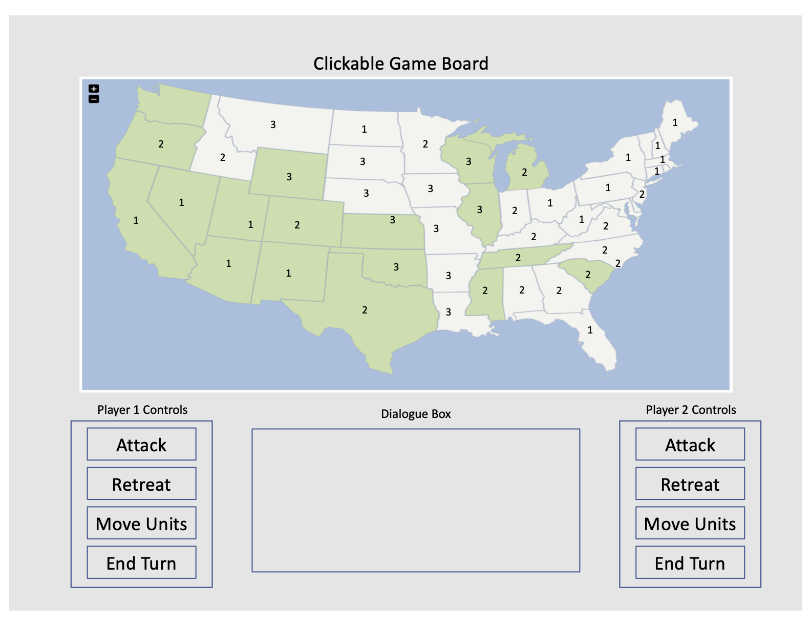

# Risk
## WireFrame

## User Story
1. Each user starts with xx units and will alternate turns placing units on game board until all units are gone.   
2. Once initial board placements are made, a randomly chosen player will go first with the options to:
    -attack neighboring states
        attack success is random with weighting for number of troops
    -retreat from attacking 
    -reinforce neighboring states 
    -end turn
3. Players who successfully attack a neighboring state will draw a card that can be traded in for additional troops once 3 like cards are collected. 
4. A player wins when they have successfully taken over all of the states. 

## Resources
Will use jquery.vmap as map library

